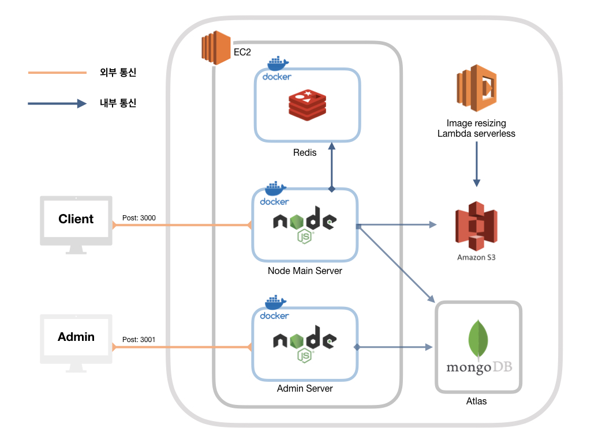
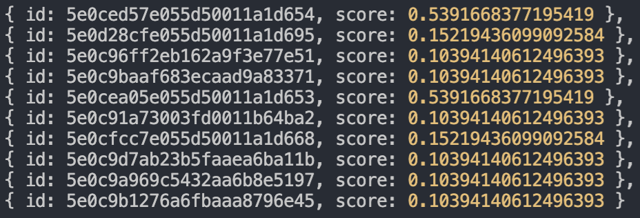
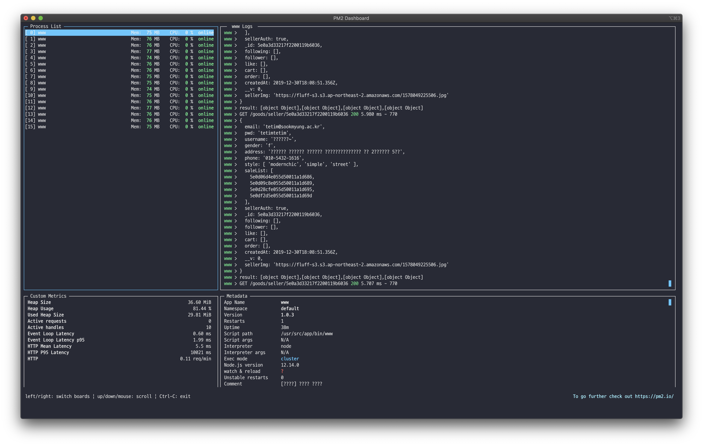
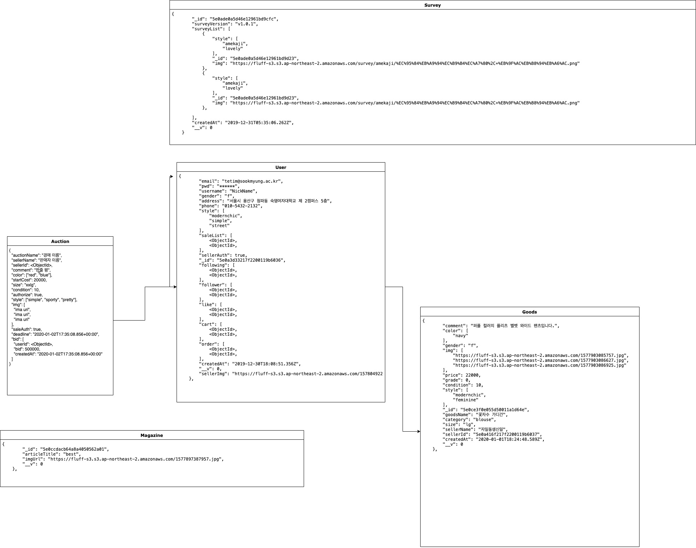

# Fluff

<div align="center" style="display:flex;">
	
</div>

<div align="center">


세상에 옷은 충분합니다. 


우리는 버려지는 옷의 숨겨진 가치를 발견하고 그 옷에 새 숨을 불어 넣습니다.


이것은 시작에 불과합니다.

합리적인 비용으로 더 많은 사람들이 자신만의 유니크한 스타일을 찾고 

환경을 보호함으로써 슬로우 패션의 가치를 세상에 퍼트립니다.


바로 이것이 fluff가 그리는 미래입니다.
</div>

---

## 우리가 일하는 방식
:bookmark:[Fluff Notin Link]( https://www.notion.so/74c4e53d65ff4312be05f55a601a8a95)

&nbsp;

## 📚 API Docs
* [Api Description Link](https://github.com/Fluff-Project/Fluff_Server/wiki)
&nbsp;

&nbsp;

## ⚙️ Dependencies
```json
"dependencies": {
    "aws-sdk": "^2.596.0",
    "content-based-recommender": "^1.4.0",
    "cookie-parser": "~1.4.4",
    "debug": "~2.6.9",
    "dotenv": "^8.2.0",
    "ejs": "^3.0.1",
    "express": "~4.16.1",
    "http-errors": "^1.7.3",
    "jade": "~1.11.0",
    "jsonwebtoken": "^8.5.1",
    "moment": "^2.24.0",
    "mongoose": "^5.8.3",
    "morgan": "^1.9.1",
    "multer": "^1.4.2",
    "multer-s3": "^2.9.0",
    "mysql2": "^2.0.2",
    "nodemailer": "^6.4.2",
    "passport": "^0.4.1",
    "path": "^0.12.7",
    "rand-token": "^0.4.0",
    "redis": "^2.8.0",
    "request": "^2.88.0",
    "request-promise": "^4.2.5",
    "sequelize": "^5.21.3",
    "socket.io": "^2.3.0",
    "sse": "0.0.8"
  }
```
---
&nbsp;
## :triangular_ruler: Architecture
> Microservices Architecture
<div align="center" style="display:flex;">
	
</div>


&nbsp;

## :key: Core Tech
1. **추천 알고리즘**\
유저의 취향을 바탕으로 **contest based filtering** 추천 알고리즘을 적용하여 유저에게 맞춤형 상품을 제공한다.

<div align="center" style="display:flex;">
	
</div>

2. **경매**\
socket을 이용하여 **실시간으로 경매에 참여할 수 있다.** 또한 server sent event로 클라이언트에게 1초에 한번씩 실시간으로 경매 마감시간을 전송함으로써 클라이언트에서 시간을 변경하여 서버에 접근하는 보안 사고를 사전에 차단하였다.

3. **멀티 컨테이너**
docker를 이용한 멀티 컨테이너 배포로 배포의 효율성을 늘리고, 마이크로 서비스들을 내부 통신망으로 묶어 아키텍처 관리를 하였다.

4. **이미지 리사이징 서버**\
쇼핑몰 특성상 이미지 업로드 양이 많기 때문에 AWS의 대표적인 serverless 서비스인 Lambda를 이용하여 이미지 리사이징 기능을 추가하였다.

5. **Mutl Processing**\
추천 알고리즘과 같은 딥러닝 기반 기능들로 인한 cpu 사용량 증가로 성능저하를 cluster를 사용하여 싱글 스레드인 Node.js의 한계를 multi processing으로 극복하였다.

<div align="center" style="display:flex;">
	
</div>


&nbsp;
---
## :open_file_folder: Database Modeling

<div align="center" style="display:flex;">
	
</div>

&nbsp;
---

## :computer: Server

- 신윤재
- 허정민
- 김채린


&nbsp;

:link: **Repository Link**
* [Admin Page Link](https://github.com/Fluff-Project/Fluff_Admin)
* [Android](https://github.com/Fluff-Project/Fluff_Android)
* [iOS](https://github.com/Fluff-Project/Fluff_iOS)
* [Image Resizin Server](https://github.com/Fluff-Project/Fluff_Img_Resizing)

&nbsp;
