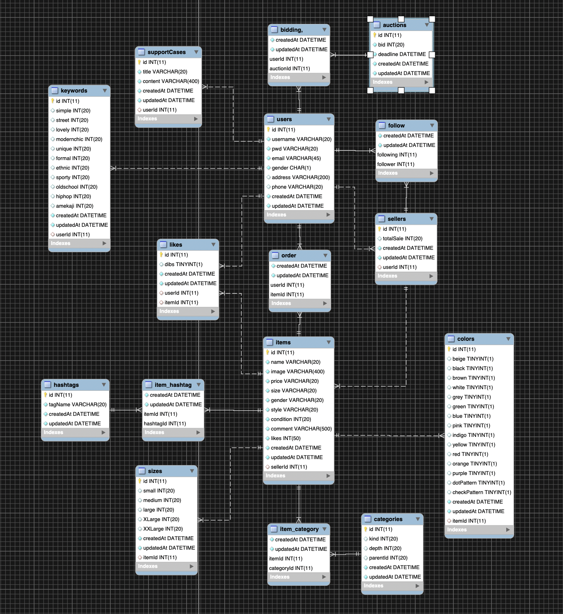

# Fluff
\

세상에 옷은 충분합니다. 우리는 버려지는 옷의 숨겨진 가치를 발견하고 그 옷에 새 숨을 불어 넣습니다.
이것은 시작에 불과합니다. 합리적인 비용으로 더 많은 사람들이 자신만의 유니크한 스타일을 찾고 환경을 보호함으로써 슬로우 패션의 가치를 세상에 퍼트립니다.
바로 이것이 fluff가 그리는 미래입니다.

\

## 우리가 모인 이유
**목표**
* 슬로우패션 문화를 대중화시키고 빠르게 변하는 세상 속 우리가 잊고 있는 가치를 일깨워준다.

**우리가 모여서 그리는 그림**
* 우리가 해냄
* 소통을 중시하고 대화하는 시간을 가질 수 있는 팀
* 모든 팀원들이 낙오되지 않고 ‘내가 해냈다!’라는 성취감을 가질 수 있는 팀

\

## 우리가 일하는 방식
* [Fluff Notin Link]( https://www.notion.so/74c4e53d65ff4312be05f55a601a8a95)

\

## Our mindset 우리의 믿음 
**The real cooperation you've ever done before.**
* 존중과 솔직함 "Let’s Trevari!" 
우리는 항상 존중하고 솔직합니다. 모두가 존중한다는 믿음이 있기에 반대 의견일지라도 적극적으로 개진합니다.

**함께하는 성장 "Get ready with us!"**
* 우리는 우리의 가능성을 믿으며, 세상의 모든 것들은 더욱 나아질 수 있다고 믿습니다.
서로 가진 능력을 나누고, 부족한 점을 채우며 함께 성장하는 팀워크 하모니를 만들어 낼 것입니다.

**상상을 현실로 "Make WOW!"**
* 우리는 직접 변화를 만들어 그 가치를 증명하고 영감과 새로운 시각을 전파하여 그 꿈을 현실로 만듭니다. 우리는 여정을 함께 하며 시장을 뒤엎는 임팩트 있는 결과를 만듭니다.

\

---
\
\

## Realize Note
* [Realize Note Link](./realeas_note.md)
\
\

## API Description
* [Api Description Link](https://github.com/Fluff-Project/Fluff_Server/wiki)
\
\

## ERD
* **ERD** v1.0.3

\

---
\

## Main Function
