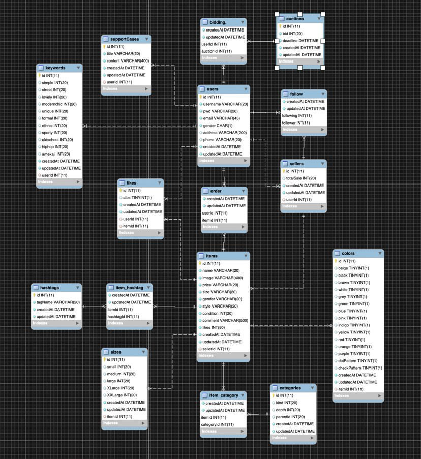

# Fluff

<div align="center" style="display:flex;">
	
</div>

<div align="center">

세상에 옷은 충분합니다.


우리는 버려지는 옷의 숨겨진 가치를 발견하고 그 옷에 새 숨을 불어넣습니다.


이것은 시작에 불과합니다.


합리적인 비용으로 더 많은 사람들이 자신만의 유니크한 스타일을 찾고


환경을 보호함으로써 슬로우 패션의 가치를 세상에 퍼트립니다.


바로 이것이 fluff가 그리는 미래입니다.
</div>

\
[]()

---
\
\
[]()
## :bookmark:우리가 일하는 방식
- [Fluff Notin Link]( https://www.notion.so/74c4e53d65ff4312be05f55a601a8a95)

\
[]()
## 📚 API Docs
* [Api Description Link](https://github.com/Fluff-Project/Fluff_Server/wiki)

\
[]()
## ⚙️ Dependencies
```json
"dependencies": {
    "content-based-recommender": "^1.4.0",
    "mongoose": "^5.8.3",
    "multer": "^1.4.2",
    "multer-s3": "^2.9.0",
  }
```
> content-based-filtering을 빠른 시간내에 구현할 수 있는 content-based-recommender 모듈을 사용하여 추천 알고리즘을 적용하였고, 그 외에 관련된 정보들을 데이터베이스에 일관성있게 저장 하였다.

\
[]()
```json
"dependencies": {
    "dotenv": "^8.2.0",
    "jsonwebtoken": "^8.5.1",
    "nodemailer": "^6.4.2",
    "passport": "^0.4.1",
    "rand-token": "^0.4.0",
    "redis": "^2.8.0",
    "sequelize": "^5.21.3",
  }
```
> dotenv를 이용해 내부적으로 security key를 통합적으로 관리하였고, redis 메모리를 이용한 데이터 임시 저장, 마지막으로 JWT를 이용해서 회원인증과 같은 보안에 신경을 썼다.

\
[]()
```json
"dependencies": {
    "socket.io": "^2.3.0",
    "sse": "0.0.8",
    "moment": "^2.24.0",
  }
```
> 실시간 경매 기능을 위항 양방향 통신인 socket.io를 이용하여 실시간으로 경매 참여자들이 최고가를 알림 받을 수 있도록 하였다. 또한 단방향 통신 server send event를 사용하여 서버에서 실시간으로 클라이언트에게 현재 시간을 전송함으로써 클라이언트에서 시간을 조작하여 불적합한 경로로 경매에 참여하는 것을 방지하였다.

\
[]()

---

\
\
[]()
## :triangular_ruler: Architecture
> Microservices Architecture
<div align="center" style="display:flex;">
	
</div>

\
[]()
## 🔒Core Technology
**🔑추천 알고리즘**
> 회원가입 초기시 조사한 유저의 취향을 바탕으로 모든 상품에 score를 매겨서  **contest based filtering**을 사용한 추천 알고리즘을 적용하여 유저에게 맞춤형 상품을 제공한다.

<div align="center" style="display:flex;">
	
</div>

\
[]()
**🔑경매**
> socket을 이용하여 **실시간으로 경매에 참여할 수 있다.** 또한 server sent event로 클라이언트에게 1초에 한번씩 실시간으로 경매 마감시간을 전송함으로써 클라이언트에서 시간을 변경하여 서버에 접근하는 보안 사고를 사전에 차단하였다.

\
[]()
**🔑멀티 컨테이너**
> docker를 이용한 멀티 컨테이너 배포로 배포의 효율성을 늘리고, 마이크로 서비스들을 내부 통신망으로 묶어 아키텍처 관리를 하였다.

\
[]()
**🔑이미지 리사이징 서버**
> 쇼핑몰 특성상 이미지 업로드 양이 많기 때문에 AWS의 대표적인 serverless 서비스인 Lambda를 이용하여 이미지 리사이징 기능을 추가하였다.

\
[]()
**🔑Redis Cache Memory**
> Redis를 사용하여서 회원가입 데이터를 가가입 상태로 분리하고, 회원가입시 입력한 이메일로 토큰 값을 포함한 인증 메일을 발송하여, 인증완료시 Database로 회원정보를 저장하여 회원가입 로직을 완료한다.

\
[]()
**🔑Mutl Processing**
> 추천 알고리즘과 같은 딥러닝 기반 기능들로 인한, cpu의 부하를 cluster의 multi processing을 이용하여 Node.js의 싱글스레드의 효율성을 극대화한다.


<div align="center" style="display:flex;">
	
</div>
&nbsp;

---
&nbsp;

&nbsp;
## :open_file_folder: Database Modeling

| NoSQL | RDB |
|:---:|:---:|
|||
> 현재는 NoSQL을 사용하여 개발하였지만, 추후에 RDB로 변경할 여지가 있다.
\
[]()

---
\
\
[]()
## :computer: Server 역할 분담

- 👨‍💻[신윤재](https://github.com/ooeunz)
- 👩‍💻[허정민](https://github.com/tape22)
- 👩‍💻[김채린](https://github.com/chaelin0722)


\
[]()

---
\
\
[]()
## :link: **Repository Link**
* [Admin Page Link](https://github.com/Fluff-Project/Fluff_Admin)
* [Android](https://github.com/Fluff-Project/Fluff_Android)
* [iOS](https://github.com/Fluff-Project/Fluff_iOS)
* [Image Resizin Server](https://github.com/Fluff-Project/Fluff_Img_Resizing)

&nbsp;
