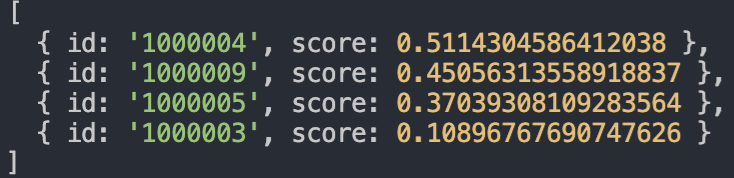

# Realease Note
\
[]()
## **1.0.1** -Snapshot
* **DB Modeling** : users, hashtag, iterms, order, recommand

\
\
[]()
## **1.0.2** -Snapshot
### User Auth
```json
"dependencies": {
    "bcrypt": "^3.0.7",
    "jsonwebtoken": "^8.5.1",
    "mysql2": "^2.0.2",
    "nodemailer": "^6.4.2",
    "rand-token": "^0.4.0",
    "redis": "^2.8.0",
    "sequelize": "^5.21.3",
  }
```
> 암호화, mail인증, JWT를 사용하기 위한 dependency
\
[]()

1. 회원 가입할 정보 입력.
2. DB에서 중복된 정보가 있는지 확인 후, 없다면 계속 진행.
3. 회원 정보를 Redis cache memory에 저장 후, 유저 email로 인증 메일을 발송. (Token을 포함)
4. 유저가 Email에서 인증버튼을 누를시 token이 다시 서버로 돌아옴.
5. Token decoded 결과 문제가 없다면 Redis에 있던 유저의 정보를 DB로 저장.

\
\
[]()
### Middle ware
해당 기능을 사용할 때 마다 Token decoded를 통해서 로그인된 유저인지 확인.

\
\
[]()
## **1.0.3** -Snapshot
Database modeling완료. -> **ERD** v1.0.3
\
[]()

\
[]()

\
\
[]()
## **1.0.4** -Snapshot
* docker-compose를 이용해서 Multi-container 아키텍처 구성.
* NoSQL로 Database 변경.
* API
  - 썸네일 리스트 조회
  - 상품 상세 페이지
  - 판매자의 다른 상품 조회
  - 좋아요 여부 조회
  - 좋아요 누르기/취소
  - 좋아요(찜) 개수 조회
  - 상품 필터링

\
\
[]()
## **1.0.5** -Snapshot
* 경매 기능 추가
* 도로명주소 api 사용
```json
"dependencies": {
  "request-promise": "^4.2.5",
}
```
\
[]()

---

\
\
[]()
## **1.1.0**
### Content Based Filtering Algorithm

유저의 취향을 기준으로 전체 상품에 추천 알고리즘을 적용.
```json
"dependencies": {
  "content-based-recommender": "^1.4.0",
}
```
**image**
 


\
[]()

---
\
\
[]()
## **1.1.1**
AWS S3를 이용한 Image upload
```json
"dependencies": {
  "multer": "^1.4.2",
  "multer-s3": "^2.9.0",
}
```
* multer 이미지 업로드
* 장바구니
* 주문 목록
* 좋아요(찜)